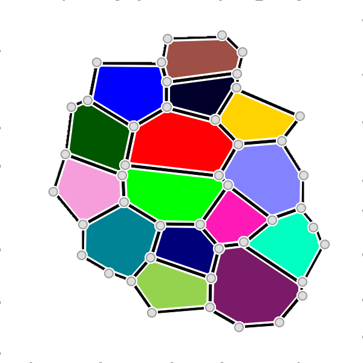

# OpenAlea CellComplex Library

The Topological Plant Tissue datastructure

###Authors

Frédéric Boudon (`frederic.boudon@cirad.fr`)
Guillaume Cerutti (`guillaume.cerutti@inria.fr`)


####Institutes: `INRIA / CIRAD`


####License: `Cecill-C`

###Description

OpenAlea.CellComplex is a library providing data structures and algorithms to represent and analyze plant cell tissues in 3D. It offers an implementation of the topological structure of cellular complex as an Incidence Graph in a class named **PropertyTopomesh**.



The structure comes with algorithms allowing to
* Create a structure from more basic representations
* Compute geometrical and topological properties and store them within the structure
* Edit the structure by local topological operations
* Read and export the structure from/to a standard PLY format (http://sainsburyworkshop2015.wikispaces.com/file/view/PlyFormat.pdf)

###Requirements

* SconsX (https://github.com/openalea/sconsx)
* OpenAlea.Deploy (https://github.com/openalea/deploy)
* OpenAlea (https://github.com/openalea/openalea)
* OpenAlea.Container (https://github.com/openalea/openalea-components)
* NumPy / SciPy


###Installation

```python
python setup.py develop
```


